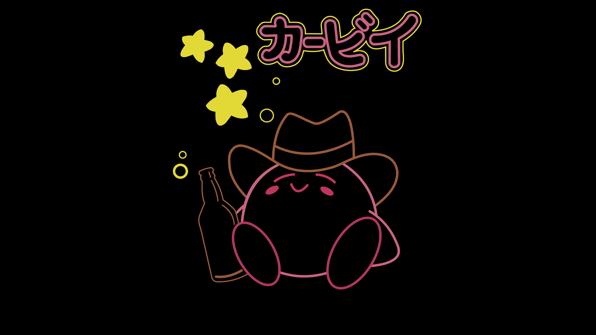
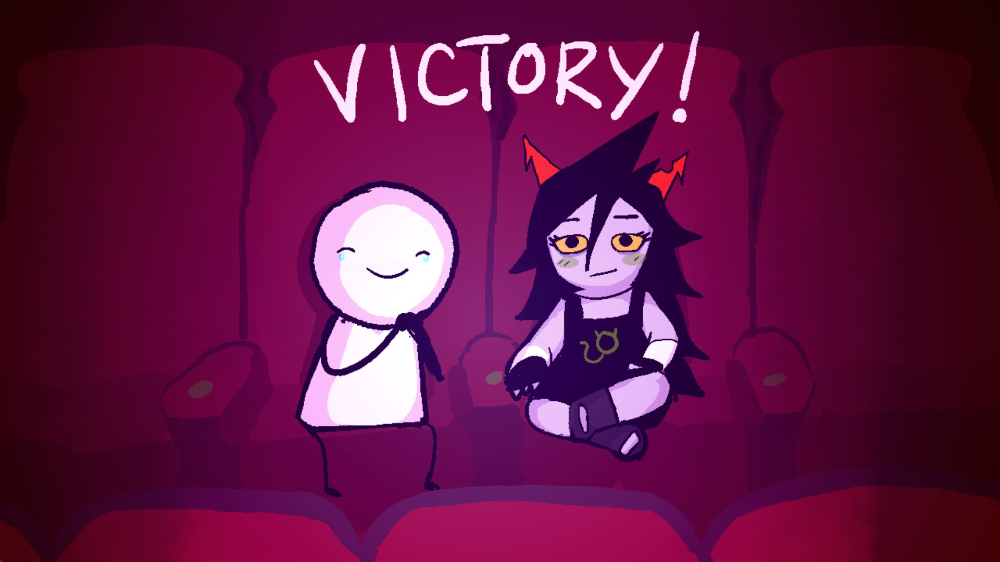

# 我和我的惰性思维

距离上一次总结大概是一个月了，这次自省的主题是我和我的惰性思维，那么什么是惰性思维呢🤨🤨🤨？

**惰性思维是指人类思维深处存在的一种保守力量，总是习惯用老眼光来看待新问题，用曾经被反复证明有效的旧观念去解释变化世界的新现象。**

## P1 思考

上面加粗的一段话有几个关键词可圈可点，例如**老眼光**、**新问题**、**有效的旧观念**和**变化的世界**等。

**老眼光**，对于我而言什么是老的眼光，首先从学习方面谈起，🌐我之前以为学习技术的过程是一个具有固定通用的过程，比如基础->熟练使用基础->高级特性->学习开源项目->进行指定特性的创新。以上便是我的惰性思维，我忽略了学习中的可变性，如对于**基础知识的熟练程度**、对于**高级特性的具体使用方法**等等，例如*一些方法设计的思想，如一个程序如果需要执行一个其他的线程，那么就需要在这个程序内部可以得知启动的线程的状态*，不然会造成内存泄漏，因此具体的执行周期应该是由发起线程进行控制，这样可以完全的管控应用的所有的生命周期。

上述是在程序设计时参悟的，在这里也是对应了两种解决方案

1. 基础知识可以根据使用的次数和组织化记忆来进行提升，这个相对于另一个问题相对来说更容易提升。
2. 高级特性可以通过阅读程序设计思想的书籍来进行提升，同时也可以通过观察开源代码的方式借鉴他人的用法，这些都是可以的。

**新问题**，新问题的解决方案，近期遇到的新的问题如：质疑AI会取代程序员；质疑后端开发的上下限；质疑自己的能力等。遇到质疑无法自己去查阅资料解决，造成了人云亦云的地步，最终导致心智会受影响，影响了自己的后续发展流程。遇到问题不应该停止不前，应当迎难直上，不应怀疑自己的能力。

**有效的旧观念**：量变产生质变，但是容易忽略一点，应该是有效的量变产生有效的质变，不应从量上来上升到质的上面。

**变化的世界**：世界是变化的，环境是变化的，同时，作为人我们也是变化的，所以变化的环境和变化的身边人共同构造成现今的我们，对于不同于自身情况的人应当有不同的应对方案。

同时，对于建设性的建议应当少提，在未真实的了解到当事人所处的情景时，要懂得“闭嘴”。事物的发展都是有一定的规律性，我们不能通过个人的干扰去打乱环境的作用（同时我们可能也是做不到的）。也许对于思、愿、力三个方面都强的人才能真正的做到打破环境的桎梏，最终得以脱颖而出。其次，便是考虑价值的本身，是否是有价值的事情？是否是有回报的事情？不做这件事会对我本身有什么影响？这就是投资和回报的相关性。

## P2 执行力

本人是一个善于观察的人，会进行归类身边人成功的规律。最重要的一点可能是执行力，那么究竟什么是执行力？

执行力，指的是**贯彻战略意图，完成预定目标的操作能力**。 是把企业战略、规划转化成为效益、成果的关键。 执行力包含完成**任务的意愿**，**完成任务的能力**，**完成任务的程度**。 

究其三点就是意愿、能力和完成程度。

意愿：大抵是指愿力，对于这件事会投入多大的精力，以及事件的重要性，这里主要是因为大部分人可能会觉得一些事情具有不必要性或者是通过自我麻痹来使自己感觉到事情的收益低微，最终愿力下降后就会使得任务慢慢的拖垮，所以做事应保持高度的精神力，专注于一件事。对于大事更应当尝试分解，而不是畏难。

能力：能力主要和个人天赋，以及上述所提的意愿有关，纵观所有人，天才应当只是寥寥无几的少数人，大部分人都是普通人，并不存在能力不足的情况，**除非是和物质挂钩的情况**，这种情况可能是大多数的情况，于是就需要考虑性价比。

完成程度：这个的话是执行力的结果，做事一定要先把握起点和重点，只有贯彻始终，以终为始才能把握到任务的优先级，进而高质量且最大程度的完成任务。

## P3 近期状况

无趣、无聊且对任何事都感觉无趣，希望去做一些有意义的事情，而不是一直在碌碌无为的度日！！！