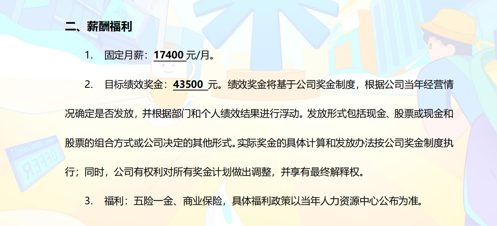

# 选择的差异性

这个总结算是来的比较迟的一次总结，在面对**好未来**和**腾讯云智**的Offer时选择了云智，可能我自己并不喜欢太过于卷的北京。

## 好未来

主要是做用户中台，不是前台的收益部门，但是有大厂的名头，方便后续跳槽。

## 腾讯云智

医疗健康事业部，网上风评也不是很好，但是感觉在武汉应该还可以把。

## 汇总

感觉现在怎么都是晚了应该，已经做出了选择了，那就坚定自己的选择走下去，不后悔。

