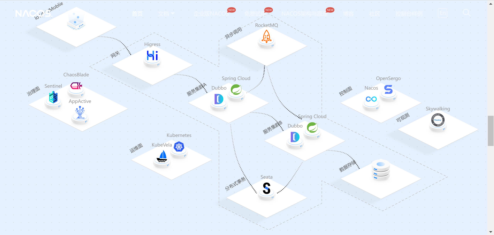

上一节我们讨论了nacos的发展及一些基本的注册中心知识，这一节我们将对于它的功能和生态进行进一步的探讨。

# 1.2 nacos功能和生态

对于我们学习技术来说，最重要的就是这门新的技术有什么样的功能，和他的生态是否强大。功能决定了它的业务适用性，任何的技术都是为业务而生。而生态则是技术的后备支持，比如说漏洞维护，功能新增等一系列的技术支持。很显然Nacos是阿里巴巴的产品，而且可以与多种技术进行集成，由此决定了它在微服务中的适用性。

## 1.2.1 特性

nacos的官网是这么说的，它是一个更易于构建云原生应用的动态服务发现、配置管理和服务管理平台。

1、服务发现和服务健康检测

服务发现和服务健康检测基本上是每一个注册中心都需要进行保证的功能。Nacos采用的是基于DNS和RPC的服务发现。支持传输层层面的健康检测，也就是我们常用的ping命令或者tcp的一系列指令，同时也迟迟应用层自定义的健康检查。

对于复杂的云环境还提供了agent 上报模式和服务端主动检测2种健康检查模式。

2、动态配置服务

动态配置可以让我们的配置文件**中心化**、**外部化**和**动态化**的管理所有环境的应用配置和服务配置，可以更加方便的管理服务，让服务进行弹性的拓展更加的简单。换句话说就是我们的配置文件不再由应用管理，而是交由一个中心化的应用进行管理，方便了配置文件的更改和版本追踪，最终还是服务于应用。

3、动态DNS服务（DDNS）

通过支持权重路由，动态DNS服务能让您轻松实现中间层负载均衡、更灵活的路由策略、流量控制以及简单数据中心内网的简单DNS解析服务。动态DNS服务还能让您更容易地实现以DNS协议为基础的服务发现，以消除耦合到厂商私有服务发现API上的风险。

4、服务及其元数据管理

Nacos 能让您从微服务平台建设的视角管理数据中心的所有服务及元数据，包括管理服务的描述、生命周期、服务的静态依赖分析、服务的健康状态、服务的流量管理、路由及安全策略、服务的 SLA 以及最首要的 metrics 统计数据。

## 1.2.2 生态

nacos的生态十分强大，它可以很方便的与一些第三方框架进行集成，具体的在此不再阐述，之后会在项目中进行一一的展现。而在此我想说的是，对于一个服务的生态，我们需要关心的是这个技术的使用方向以及使用的广度。

对于本书的nacos来说，他有非常多的使用方案，包括配置分发，服务发现等，因为背靠阿里巴巴这个巨大的生态圈，也使得它的更新迭代也是非常快的，我们在使用的初期仅需要去掌握使用即可，等到我们使用的次数多了，再去探讨核心功能的实现才是最好的‘食用方式‘。下图为Nacos的生态图：

