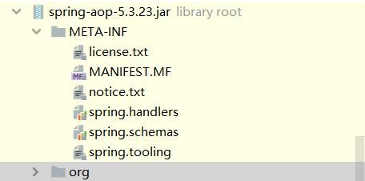

# Spring AOP编程模型

- 注解驱动
  - 实现：Enable 模块驱动， @EnableAspectJAutoProxy
  - 注解：
    - 激活AspectJ自动代理：@EnableAspectJAutoProxy
    - Aspect: @Aspect
    - Pointcut: @Pointcut
    - Advice: @Before、@AfterReturning、@AfterThrowing、@After、@Around
    - Introduction: @DeclareParents

- XML配置驱动
  - 实现：Spring Extensble XML Authoring
  - XML元素
    - 激活AspectJ自动代理：\<aop:aspectj-autoproxy/\>
    - 配置：\<aop:config>
    - Aspect: \<aop:aspect>
    - Pointcut:\<aop:pointcut>
    - Advice:\<aop:around/>、\<aop:before/>、\<aop:after-returning/>、\<aop:after-throwing/>和\<aop:after>
    - Introduction:\<aop:declare-parents/>
    - 代理Scope:\<aop:scoped-proxy>

在AOP项目的META-INF目录中定义了XML驱动配置的标签名，

有对应的处理器和schemas,可以看到规定的spring-aop.xsd文件规定了标准的元素，然后由指定的Handler进行处理。

然后我们来看一下对应的advice

```java
// 顶级的AdviCe的接口
public interface Advice {
}

// 其他的则是继承此接口作为标记型接口
public interface AfterAdvice extends Advice {
}

public interface AfterReturningAdvice extends AfterAdvice {
    void afterReturning(@Nullable Object returnValue, Method method, Object[] args, @Nullable Object target) throws Throwable;
}
```

Spring则是通过标记型接口进行定义AOP的具体的行为，然后进而来进行实现AOP功能。