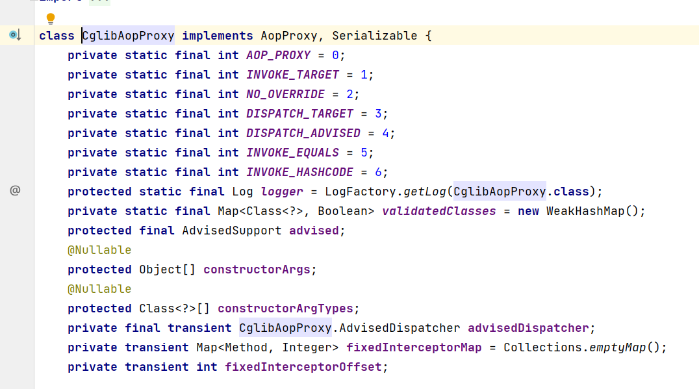
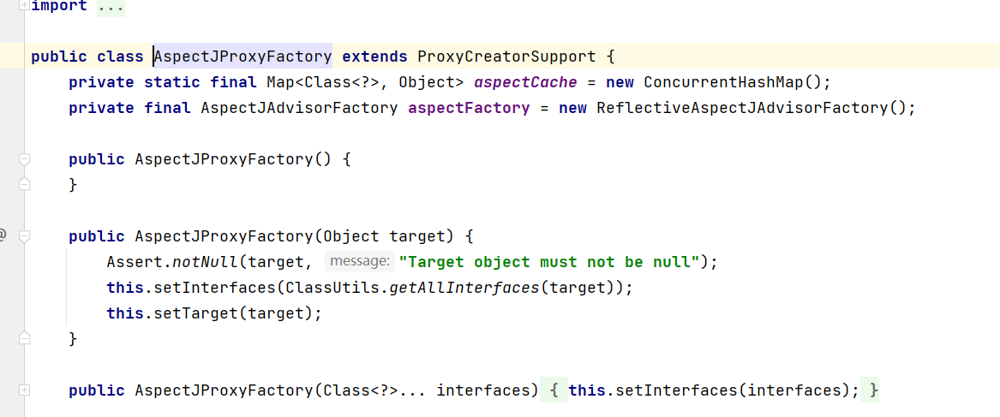

# Spring AOP代理实现:为什么Spring Framework选择三种不同AOP 实现?

- JDK 动态代理实现-基于接口代理
- CGLIB动态代理实现-基于类代理（字节码提升）
- AspectJ适配实现

在Spring中定义了aop代理的顶层接口AopProxy,主要提供了两个重载的方法，第一个是使用当前线程类的方式进行加载动态代理的类，第二种则是指定类加载器的方式。

```java
public interface AopProxy {
    Object getProxy();
    Object getProxy(@Nullable ClassLoader classLoader);
}
```

其中主要有两个实现JdkDynamicAopProxy、CglibAopProxy

JDK的化主要是通过代理接口实现的


实现了AopProxy和InvocationHandler的方式来进行AOP的代理。

第二种则是CglibAopProxy,通过CGlib来进行字节码的提升，然后以之前的类作为新的类的父类，然后进行功能的提升。



两种实现均为包内的，也就是对于外部来说是无法访问的，由此可以进行规定在指定的场景下使用对应的代理的方式，即对于接口采用JDK，对于类的话采用字节码提升的方式。

然后我们再来看一下AspectJ的实现



通过AspectJ的方式来进行代理的对象，与Aspect来进行了整合。取决于用户的选择，通常采用的是xml，很少用到底层的API。