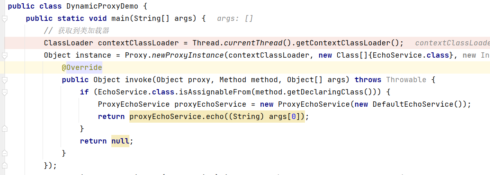
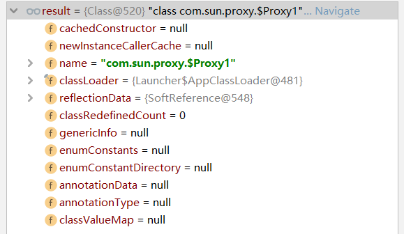
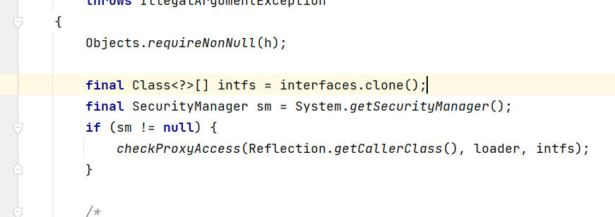
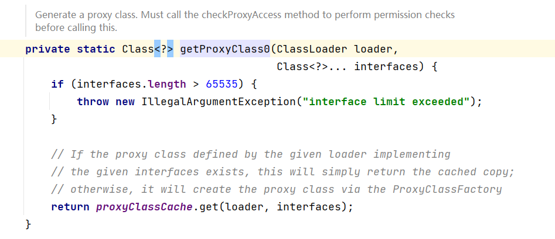
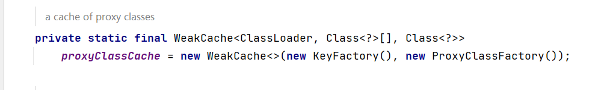
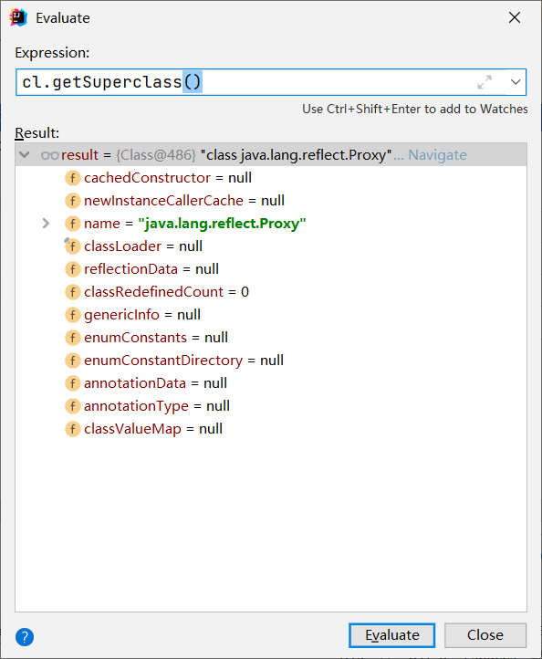
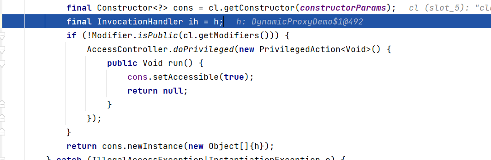
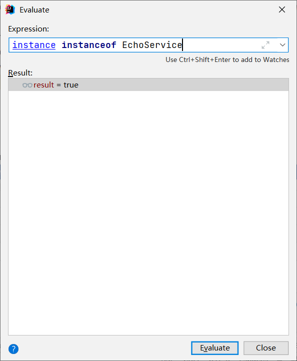

# JDK动态代理:为什么Proxy.newProxyInstance会生成新的字节码?

- 为什么会生成新的字节码？

我们在之前使用的JDK动态代理的实现上打上断点，看一下生成的代理对象的名称是什么




我们知道对于一个对象来说，它主要是通过类的方式来进行加载的，那么就是说这个com.sun.proxy.$Proxy0是一个真真实实存在于内存的类，然后我们新建一个动态代理的对象，然后继续观察其类名是什么



可以看到其对应的类名是动态的进行生成的，那么就一定会有其对应的类存在。

然后我们来看一下具体的这个代理对象产生的过程，主要是观察Proxy类的newProxyInstance方法



可以看到在刚进入这个方法的时候，接口进行了一次克隆，那么为什么要进行克隆呢？对于外部提供的接口来说，其对象是可以进行改变的，但是一旦传递进来就要保证其代理的接口是不变的，所以要进行单独的克隆一份。

```
Class<?> cl = getProxyClass0(loader, intfs);
```



再往下的话是生成的代理字节码文件，通过proxyClassCache这个对象来获取



为什么是使用WeakCache呢？算是对于内存的优化，因为代理对象一旦生成后，那么代理类之后就不一定会使用到，如果一旦反复的进行创建并存留在内存中就有可能导致虚拟机的内存不足，因此采用这个存储，在使用之后可以做到释放内存的作用。

在这个ProxyClassFactory中，我们可以观察到这个代理类的具体生成过程。

```java
 private static final class ProxyClassFactory
        implements BiFunction<ClassLoader, Class<?>[], Class<?>>
    {
        // 生成代理类的所有前缀
        private static final String proxyClassNamePrefix = "$Proxy";

        // 下一个代理的数字
        private static final AtomicLong nextUniqueNumber = new AtomicLong();
		
     	// 实现了BiFunction，具体的调用会在这里
        @Override
        public Class<?> apply(ClassLoader loader, Class<?>[] interfaces) {

            Map<Class<?>, Boolean> interfaceSet = new IdentityHashMap<>(interfaces.length);
            
            for (Class<?> intf : interfaces) {
                /*
                 * Verify that the class loader resolves the name of this
                 * interface to the same Class object.
                 */
                Class<?> interfaceClass = null;
                try {
                    // 在这里重新使用类加载器进行加载
                    interfaceClass = Class.forName(intf.getName(), false, loader);
                } catch (ClassNotFoundException e) {
                }
                // 保证先前的class和现在的Class是通过相同的类加载器加载的
                if (interfaceClass != intf) {
                    throw new IllegalArgumentException(
                        intf + " is not visible from class loader");
                }
				// 是否为接口
                if (!interfaceClass.isInterface()) {
                    throw new IllegalArgumentException(
                        interfaceClass.getName() + " is not an interface");
                }
				// 是不是唯一的接口
                if (interfaceSet.put(interfaceClass, Boolean.TRUE) != null) {
                    throw new IllegalArgumentException(
                        "repeated interface: " + interfaceClass.getName());
                }
            }

            String proxyPkg = null;     // package to define proxy class in
            int accessFlags = Modifier.PUBLIC | Modifier.FINAL;

            for (Class<?> intf : interfaces) {
                int flags = intf.getModifiers();
                if (!Modifier.isPublic(flags)) {
                    accessFlags = Modifier.FINAL;
                    String name = intf.getName();
                    int n = name.lastIndexOf('.');
                    String pkg = ((n == -1) ? "" : name.substring(0, n + 1));
                    if (proxyPkg == null) {
                        proxyPkg = pkg;
                    } else if (!pkg.equals(proxyPkg)) {
                        throw new IllegalArgumentException(
                            "non-public interfaces from different packages");
                    }
                }
            }

            if (proxyPkg == null) {
                // if no non-public proxy interfaces, use com.sun.proxy package
                proxyPkg = ReflectUtil.PROXY_PACKAGE + ".";
            }

            /*
             *	产生代理类名称
             */
            long num = nextUniqueNumber.getAndIncrement();
            String proxyName = proxyPkg + proxyClassNamePrefix + num;

            /*
             * 产生代理类
             */
            byte[] proxyClassFile = ProxyGenerator.generateProxyClass(
                proxyName, interfaces, accessFlags);
            try {
                // 通过修改后的字节码重新的加载代理的类，和之前的类加载器的底层相同，从字节码加载类
                return defineClass0(loader, proxyName,
                                    proxyClassFile, 0, proxyClassFile.length);
            } catch (ClassFormatError e) {
                /*
                 * A ClassFormatError here means that (barring bugs in the
                 * proxy class generation code) there was some other
                 * invalid aspect of the arguments supplied to the proxy
                 * class creation (such as virtual machine limitations
                 * exceeded).
                 */
                throw new IllegalArgumentException(e.toString());
            }
        }
    }
```

为什么要确保是同一个类加载器加载的？因为对于不同的类加载器来说，加载的class文件会在方法区生成两个类文件，且相互之间不可见，而且会在产生对象的时候生成两个不同的实例。

我们继续来看生成代理类的父类是什么？



我们可以看到他的父类是Proxy，这说明代理类是继承Proxy的



然后会将我们传入的Invocation对象获取到，然后在最后进行新建实例，然后我们就得到了代理的对象，那么在此时为什么可以强制转化为EchoService呢，我们不妨猜测，它实现了EchoService。



然后我们就得到了最终的代理对象，综上所述，我们可以判断出，具体的代理类的层次是

proxy0 extends Proxy implements  EchoService,通过调用父类的构造函数来建立具有处理器的Handler对象。