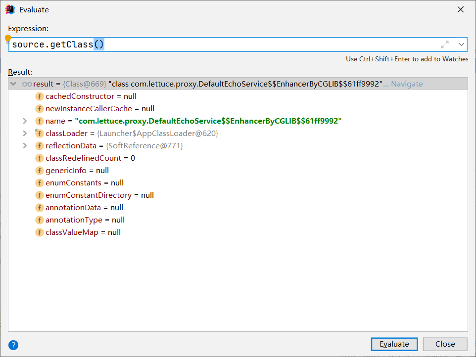

# CGLIB 动态代理

CGLIB主要是用于字节码提升的，在JAVA的配置类里面比较常见，一旦被声明为配置类，就会得到字节码提升，我们先来看一下ConfigurationClassPostProcessor，在这个类里面会对于配置类进行提升，主要的是Enhancer,在这个类中是ConfigurationClassEnhancer，内部嵌入了CGLIB，以防版本迭代的变化。

```java
    private Enhancer newEnhancer(Class<?> configSuperClass, @Nullable ClassLoader classLoader) {
        // 新建了Enhancer对象
        Enhancer enhancer = new Enhancer();
        // 设置属性
        enhancer.setSuperclass(configSuperClass);
        enhancer.setInterfaces(new Class[]{ConfigurationClassEnhancer.EnhancedConfiguration.class});
        enhancer.setUseFactory(false);
        // 设置命名方式，也就是说通过CGLIB代理提升的类都会带上BySpringCGLIB
        enhancer.setNamingPolicy(SpringNamingPolicy.INSTANCE);
        enhancer.setStrategy(new ConfigurationClassEnhancer.BeanFactoryAwareGeneratorStrategy(classLoader));
        // 设置回调过滤
        enhancer.setCallbackFilter(CALLBACK_FILTER);
        enhancer.setCallbackTypes(CALLBACK_FILTER.getCallbackTypes());
        return enhancer;
    }
```

然后我们来进行自己使用CGLIB来实现我们之前的类提升。

```java
public class CglibDynamicProxyDemo {
    public static void main(String[] args) {
        Enhancer enhancer = new Enhancer();
        // 指定父类
        Class<?> superClass = DefaultEchoService.class;
        enhancer.setSuperclass(superClass);
        // 指定拦截的接口
        enhancer.setInterfaces(new Class[]{EchoService.class});
        // 设置回调方法
        enhancer.setCallback(new MethodInterceptor() {
            /**
             *
             * @param source 源对象
             * @param method 拦截方法
             * @param args 参数
             * @param methodProxy 代理方法
             * @return
             * @throws Throwable
             */
            @Override
            public Object intercept(Object source, Method method, Object[] args, MethodProxy methodProxy) throws Throwable {
                long start = System.currentTimeMillis();
                // 错误的调用，调用的还是本类的这个方法
                // Object result = method.invoke(source, args);
                // 应该是调用的父类的方法
                Object result = methodProxy.invokeSuper(source, args);
                long end = System.currentTimeMillis();
                System.out.println("[Cglib] execute use time is " + (end - start) + " ns .");
                return result;
            }
        });
        EchoService echoService = (EchoService) enhancer.create();
        echoService.echo("hello, world");
    }
}
```

我们来观察下source是什么类



可以看到Source是Cglib已经生成的代理类