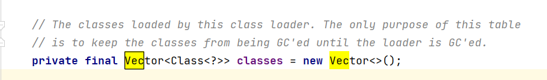
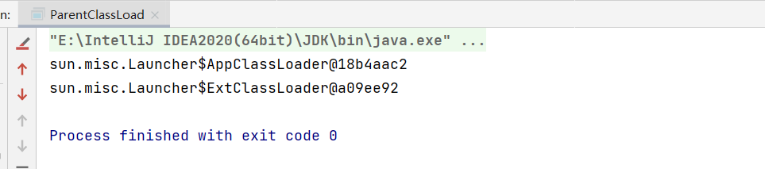
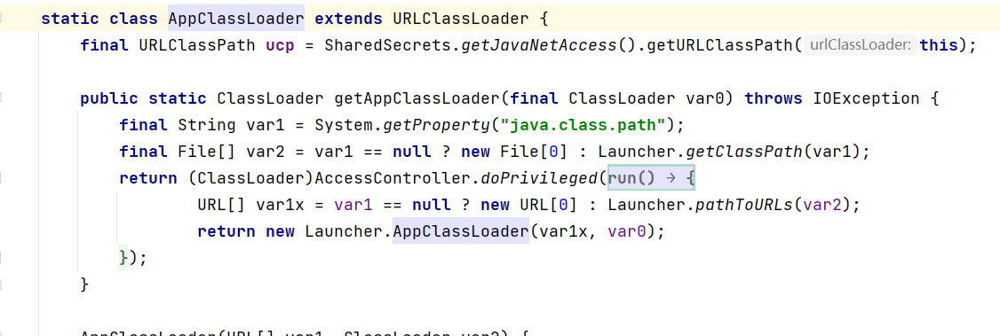
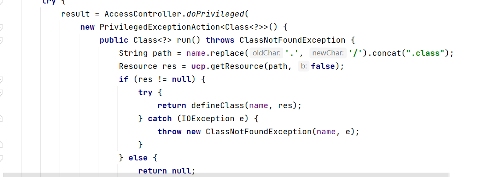

# AOP引入：OOP存在的局限性

- Java OOP存在哪些局限性
  - 静态化语言：类结构一旦定义，不同意被修改
  - 侵入性拓展：通过继承和组合组织新的类结构

我们来看一下具体的类加载的过程，来探讨下为什么类结构难被修改，我们需要观察的类是java.lang包下的ClassLoader。



我们来编写一个程序来看一下双亲委派机制

```java
public class ParentClassLoad {
    public static void main(String[] args) {
        ClassLoader parent = Thread.currentThread().getContextClassLoader();
        while (true) {
            if (parent == null) {
                break;
            }
            System.out.println(parent);
            parent = parent.getParent();
        }
    }
}
```



在这里可以看到对应的两个类加载器，启动类加载器和拓展类加载器。





在对应的视线中我们看到了，他是通过指定对应的cp然后来进行寻找加载，通过定位的方法主要是通过URL资源定位的方式

可以看到具体的加载的Class是存储在Vector类中，然后我们来具体看一下loadClass方法

```java
    public Class<?> loadClass(String name) throws ClassNotFoundException {
        return loadClass(name, false);
    }

	    protected Class<?> loadClass(String name, boolean resolve)
        throws ClassNotFoundException
    {
        synchronized (getClassLoadingLock(name)) {
            // First, check if the class has already been loaded
            // 在这里进行查找这个类是否已经被加载，这里的实现是采用了native方法
            Class<?> c = findLoadedClass(name);
            if (c == null) {
                long t0 = System.nanoTime();
                try {
                    // 双亲委派机制
                    if (parent != null) {
                        c = parent.loadClass(name, false);
                    } else {
                        c = findBootstrapClassOrNull(name);
                    }
                } catch (ClassNotFoundException e) {
                    // ClassNotFoundException thrown if class not found
                    // from the non-null parent class loader
                }

                if (c == null) {
                    // If still not found, then invoke findClass in order
                    // to find the class.
                    long t1 = System.nanoTime();
                    // 在这里进行查找
                    c = findClass(name);

                    // this is the defining class loader; record the stats
                    sun.misc.PerfCounter.getParentDelegationTime().addTime(t1 - t0);
                    sun.misc.PerfCounter.getFindClassTime().addElapsedTimeFrom(t1);
                    sun.misc.PerfCounter.getFindClasses().increment();
                }
            }
            if (resolve) {
                resolveClass(c);
            }
            return c;
        }
    }
```

因此类的双亲委派机制大概就可以整清楚了，那么为什么它会具有局限性呢，从上面我们都已经看出了，类加载的很多方法基于的是本地方法，和字节码相关，因此在形成完整的类结构后就很难进行改变。

而对于AOP来说它提供了一些接口式的改变字节码的方法，因此对于绝大多数人来说可能更适应这一种。但是要注意频繁的修改字节码会降低程序的性能，因为在业务开发的时候一般是不允许修改字节码的，因为类加载器相关的类都在原空间，不易被回收，所以在使用的时候需要非常注意。

