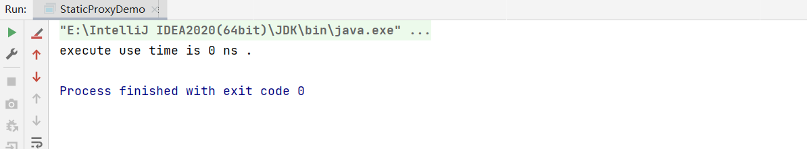

# JAVA AOP代理模式（Proxy）:JAVA静态代理和动态代理的区别是什么？

- Java 静态代理
  - 常用OOP继承和组合相结合
- Java动态代理
  - JDK动态代理
  - 字节码提升，如CGLIB

对于代理来说最主要的目的是不侵入性，即增强的方法结构不会对原生的代码结构造成侵入，这便是代理的优点所在。

静态代理采取的是组合的方式，代理类和原生类在一开始就是规定好了的，所以对于动态性很是不足。

```java
/**
 * Echo 服务
 */
public interface EchoService {
    /**
     * 输出
     * @param message
     * @return
     */
    String echo(String message);
}

public class DefaultEchoService implements EchoService{
    @Override
    public String echo(String message) {
        return message;
    }
}

public class ProxyEchoService implements EchoService{

    private final EchoService echoService;

    public ProxyEchoService(EchoService echoService) {
        this.echoService = echoService;
    }

    @Override
    public String echo(String message) {
        long start = System.currentTimeMillis();
        String result = echoService.echo(message);
        long end = System.currentTimeMillis();
        System.out.println("execute use time is " + (end -start) +" ns .");
        return result;
    }
}

public class StaticProxyDemo {
    public static void main(String[] args) {
        EchoService echoService = new ProxyEchoService(new DefaultEchoService());
        echoService.echo("hello, world");
    }
}
```



这里通过组合的方式实现，

然后我们再通过动态代理来实现，看一下JDK动态代理的实现，JDK的动态代理主要是通过代理接口实现的。

```java
public class DynamicProxyDemo {
    public static void main(String[] args) {
        // 获取到类加载器
        ClassLoader contextClassLoader = Thread.currentThread().getContextClassLoader();
        Object instance = Proxy.newProxyInstance(contextClassLoader, new Class[]{EchoService.class}, new InvocationHandler() {
            @Override
            public Object invoke(Object proxy, Method method, Object[] args) throws Throwable {
                if (EchoService.class.isAssignableFrom(method.getDeclaringClass())) {
                    ProxyEchoService proxyEchoService = new ProxyEchoService(new DefaultEchoService());
                    return proxyEchoService.echo((String) args[0]);
                }
                return null;
            }
        });
        EchoService echoService = (EchoService) instance;
        echoService.echo("hello, world");
    }
}
```

首先，我们需要获得到当前类的加载器，然后再声明一个Class数组，因为JDK的动态代理是支持同时代理多个接口的，所以在代理的具体实现时我们可以加上判断，是否是我们想要代理的接口方法，然后在代理类里面进行实现。最终通过强制类型转换，转换为我们期望的类型。

静态代理和动态代理的区别是，静态代理在执行时已经确定了此时增强的实现，而动态代理只有在运行时才会确定自己代理的具体增强的何处。

