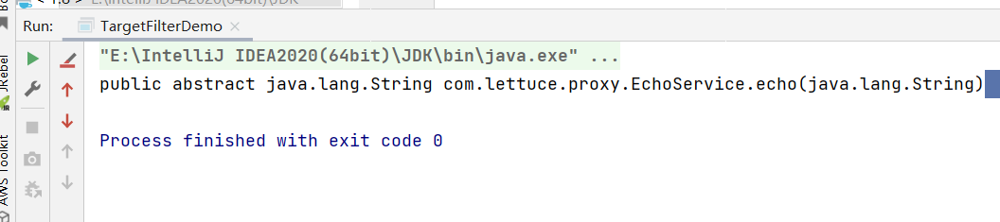
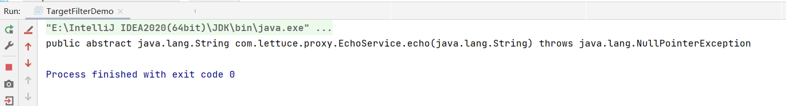
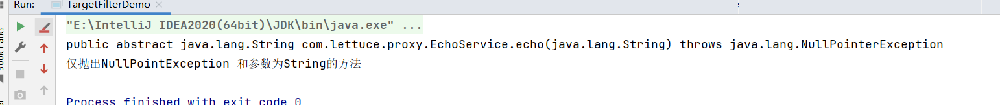

# JAVA AOP 判断模式（Predicate）:如何筛选Join Point?

- 判断来源
  - 类型（Class）
  - 方法（Method）
  - 注解（Annotation）
  - 参数（Parameter）
  - 异常（Exception）

```java
public class TargetFilterDemo {
    public static void main(String[] args) throws ClassNotFoundException {
        String  targetClassName = "com.lettuce.proxy.EchoService";
        // 获取到当前线程的类加载器
        ClassLoader classLoader = Thread.currentThread().getContextClassLoader();
        // 加载目标类
        Class<?> targetClass = classLoader.loadClass(targetClassName);
        // 方法定义 String echo(String message)
        // 使用Spring反射工具类
        Method targetMethod = ReflectionUtils.findMethod(targetClass, "echo", String.class);
        System.out.println(targetMethod);
    }
}
```



这里我们使用类加载器去加载了对应的接口类，然后我们通过Spring的工具类也获取到了对应的Method，然后我们打印对应的函数签名。

那么对于异常的话会打印吗，我们在方法签名上加上对应的异常



然后也能打印出对应的异常情况，然后我们继续使用Spring的反射API来进行判断方法是否是符合我们的需求的：

```java
public class TargetFilterDemo {
    public static void main(String[] args) throws ClassNotFoundException {
        String  targetClassName = "com.lettuce.proxy.EchoService";
        // 获取到当前线程的类加载器
        ClassLoader classLoader = Thread.currentThread().getContextClassLoader();
        // 加载目标类
        Class<?> targetClass = classLoader.loadClass(targetClassName);
        // 方法定义 String echo(String message)
        // 使用Spring反射工具类
        Method targetMethod = ReflectionUtils.findMethod(targetClass, "echo", String.class);
        System.out.println(targetMethod);

        // 判断方法具有相应的条件的
        // 在这里做方法的具体调用，只要下方符合才会调用
        ReflectionUtils.doWithMethods(
                targetClass,
                method -> System.out.println("仅抛出NullPointException 和参数为String的方法"),
                new ReflectionUtils.MethodFilter() {
                    @Override
                    public boolean matches(Method method) {
                        Class[] parameterTypes = method.getParameterTypes();
                        Class[] exceptionTypes = method.getExceptionTypes();
                        return parameterTypes.length == 1
                                && String.class.equals(parameterTypes[0])
                                && exceptionTypes.length == 1
                                && NullPointerException.class.equals(exceptionTypes[0])
                                ;
                    }
                }
        );
    }
}
```



可以看到这里找到了对应的方法，而对于AspectJ来说也是采取了这样的方法来进行判断参数是否来进行拦截，是否进行处理。