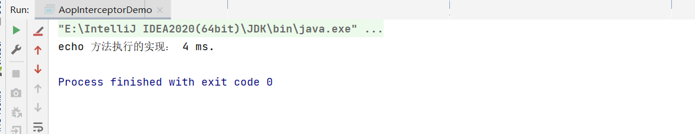

# JAVA AOP 拦截器模式（Interceptor）

- 拦截类型
  - 前置拦截（Before）
  - 后置拦截（After）
  - 异常拦截（Exception）

```java
public interface AfterInterceptor {

    /**
     *
     * @param proxy
     * @param method
     * @param args
     * @param returnResult 返回结果
     * @return
     */
    Object after(Object proxy, Method method, Object[] args, Object returnResult);
}
```

```java
public interface BeforeInterceptor {

    /**
     * 前置执行
     * @param proxy
     * @param method
     * @param args
     * @return
     */
    Object before(Object proxy, Method method, Object[] args);
}
```

```java
public interface ExceptionInterceptor {
    /**
     *
     * @param proxy
     * @param method
     * @param args
     * @param throwable
     */
    void intercept(Object proxy, Method method, Object[] args, Throwable throwable);
}
```

```java
public interface FinallyInterceptor {

    /**
     *
     * @param proxy
     * @param method
     * @param args
     * @param returnResult 返回结果
     * @return
     */
    Object finalize(Object proxy, Method method, Object[] args, Object returnResult);
}
```

```java
package com.lettuce.Interceptor;

import com.lettuce.proxy.DefaultEchoService;
import com.lettuce.proxy.EchoService;

import java.lang.reflect.InvocationHandler;
import java.lang.reflect.Method;
import java.lang.reflect.Proxy;

/**
 * @description: AOP拦截器测试
 * @author: xuyujie
 * @date: 2023/10/27
 **/
public class AopInterceptorDemo {
    public static void main(String[] args) {
        // 获取到类加载器
        ClassLoader contextClassLoader = Thread.currentThread().getContextClassLoader();
        Object instance = Proxy.newProxyInstance(contextClassLoader, new Class[]{EchoService.class}, new InvocationHandler() {
            @Override
            public Object invoke(Object proxy, Method method, Object[] args) throws Throwable {
                if (EchoService.class.isAssignableFrom(method.getDeclaringClass())) {
                    // 前置拦截器
                    BeforeInterceptor beforeInterceptor = new BeforeInterceptor() {
                        @Override
                        public Object before(Object proxy, Method method, Object[] args) {
                            return System.currentTimeMillis();
                        }
                    };
                    Long startTime = 0L;
                    Long endTime = 0L;
                    try {
                        startTime = (Long) beforeInterceptor.before(proxy, method, args);
                        // 执行
                        EchoService echoService = new DefaultEchoService();
                        Object result = echoService.echo((String) args[0]);
                        // 方法执行后置
                        AfterInterceptor afterInterceptor = new AfterInterceptor() {
                            @Override
                            public Object after(Object proxy, Method method, Object[] args, Object returnResult) {
                                return System.currentTimeMillis();
                            }
                        };
                        endTime = (Long) afterInterceptor.after(proxy,method,args, result);
                    } catch (Exception e) {
                        // 异常拦截器(处理方法执行后)
                        ExceptionInterceptor interceptor = new ExceptionInterceptor() {
                            @Override
                            public void intercept(Object proxy, Method method, Object[] args, Throwable throwable) {
                                System.out.println("拦截异常");
                            }
                        };
                        interceptor.intercept(proxy,method,args, e);
                    }finally {
                        // finally最终拦截器
                        FinallyInterceptor finallyInterceptor = new TimeFinallyInterceptor(startTime,endTime);
                        Long costTime = (Long) finallyInterceptor.finalize(proxy, method, args, null);
                        System.out.println("echo 方法执行的实现： " + costTime + " ms.");
                    }
                }
                return null;
            }
        });
        EchoService echoService = (EchoService) instance;
        echoService.echo("hello, world");
    }
}
class TimeFinallyInterceptor implements FinallyInterceptor {

    private final Long startTime;

    private final Long endTime;

    TimeFinallyInterceptor(Long startTime, Long endTime) {
        this.startTime = startTime;
        this.endTime = endTime;
    }

    @Override
    public Object finalize(Object proxy, Method method, Object[] args, Object returnResult) {
        Long costTime = endTime - startTime;
        return costTime;
    }
}
```

大概的拦截模板，都是基于一个高度抽象接口实现的，然后提供代理的方式，这样的话可以将对应的前置、后置等等的接口实现添加，然后不对原生的功能起干扰，是以可插拔的形式出现的，之后的拦截模式也是基于这几种，通过前置，后置，异常，环绕，最终等等。



