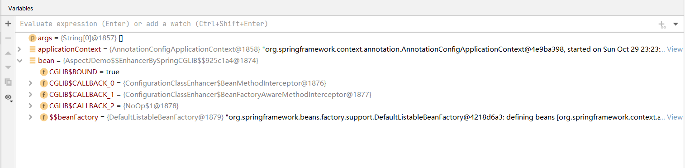

# @AspectJ 注解驱动

- 激活@AspectJ模块
  - 注解驱动-@EnableAspectJaAutoProxy
  - XML配置-\<aop:aspectj-autoproxy/>
- 声明Aspect
  - @Aspect

```java
@Aspect
@Configuration
@EnableAspectJAutoProxy
public class AspectJDemo {
    public static void main(String[] args) {
        AnnotationConfigApplicationContext applicationContext = new AnnotationConfigApplicationContext();
        applicationContext.register(AspectJDemo.class);
        applicationContext.refresh();
        AspectJDemo bean = applicationContext.getBean(AspectJDemo.class);
        applicationContext.close();
    }
}
```

使用注解的方式配置AspectJ的AOP功能



可以看到这个bean是被CGLIB增强的，大多数的功能也具有。

然后我们来看一下xml形式的组装

```java
@Configuration
@Aspect
public class AspectJXmlDemo {
    public static void main(String[] args) {
        ClassPathXmlApplicationContext applicationContext = new ClassPathXmlApplicationContext("classpath:META-INF/spring-aop-context.xml");
       // AspectJDemo bean = applicationContext.getBean(AspectJDemo.class);
        applicationContext.close();
    }
}
```

```xml
<?xml version="1.0" encoding="UTF-8"?>
<beans xmlns="http://www.springframework.org/schema/beans"
       xmlns:aop="http://www.springframework.org/schema/aop"
       xmlns:context="http://www.springframework.org/schema/context"
       xmlns:xsi="http://www.w3.org/2001/XMLSchema-instance"
       xsi:schemaLocation="http://www.springframework.org/schema/beans
       http://www.springframework.org/schema/beans/spring-beans.xsd
       http://www.springframework.org/schema/aop
       http://www.springframework.org/schema/aop/spring-aop.xsd
       http://www.springframework.org/schema/context
       http://www.springframework.org/schema/aop/spring-context.xsd" >
    <aop:aspectj-autoproxy/>
</beans>
```

