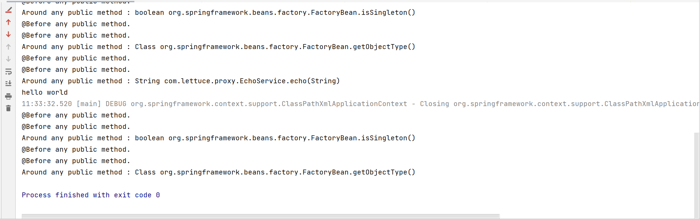

# Before Advice

## XML 实现Before Advice

- XML 元素 -\<aop:before>
  - 声明规则
    - \<aop:config>
      - \<aop:aspect>
        - \<aop:before>
- 属性设置（来源于Spring AOP Schema 类型 basicAdvice Type）
  - pointcut: Pointcut 表达式内容
  - pointcut-ref:  Pointcut 表达式名称

```xml
    <aop:config>
        <aop:aspect id="AspectXmlConfig" ref="aspectXmlConfig">
            <aop:pointcut id="anyPublicMethod" expression="execution(public * *(..))"/>
            <aop:before method="beforeAnyPublicMethod" pointcut-ref="anyPublicMethod"/>
            <aop:before method="beforeAnyPublicMethod" pointcut="execution(public * *(..))"/>
            <aop:around method="aroundAnyPublicMethod" pointcut-ref="anyPublicMethod"/>
        </aop:aspect>
    </aop:config>
```

可以看到，一旦我们将这个before引用两次，之后的执行before就是执行了两次



一般的在同一个aspect中，around一般是在before之前，基于配置这样。在不同的aspect，一般是由order实现。

# API 实现 Before Advice

- 核心接口 - org.springframework.aop.BeforeAdvice
  - 类型： 标记接口， 与 org.aopalliance.aop.Advice 类似
  - 方法 JoinPoint 拓展 -org.springframework.aop.MethodBeforeAdvice
  - 接受对象 - org.springframework.aop.framework.AdvisedSupport
    - 基础实现类 - org.springframework.aop.framework.ProxyCreatorSupport
      - 常见实现类
        - org.springframework.aop.framework.ProxyFactory
        - org.springframework.aop.framework.ProxyFactoryBean
        - org.springframework.aop.aspectj.annotation.AspectJProxyFactory