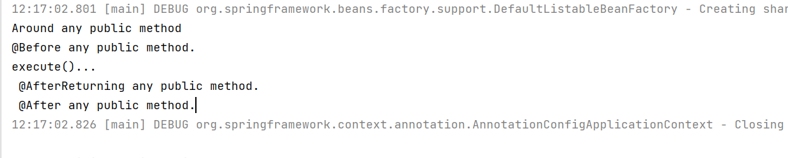
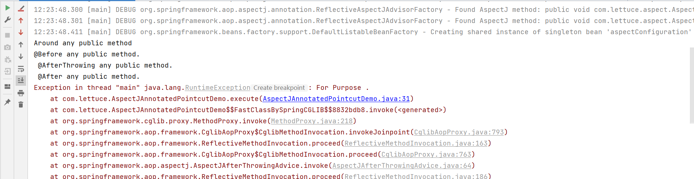
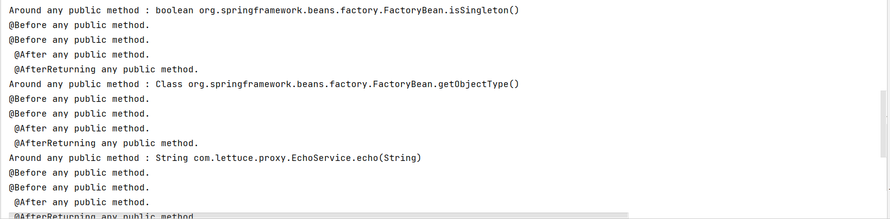
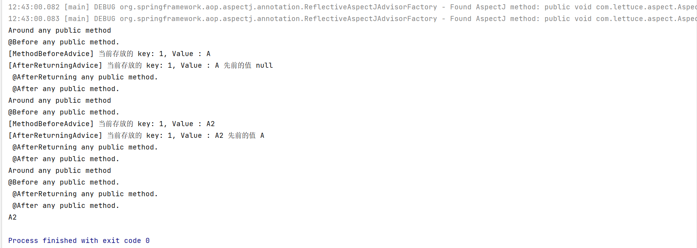

# @AspectJ 后置动作

- After Advice 注解
  - 方法返回后： @org.aspectj.lang.annotation.AfterReturning
  - 异常发生后:@org.aspectj.lang.annotation.AfterThrowing
  - finally执行:@org.aspectj.lang.annotation.After

我们通过书写代码，来进行使用对应的After操作

```java
    @After("anyPublicMethod()")
    public void afterAnyPublicMethod() {
        System.out.println(" @After any public method.");
    }

    @AfterReturning("anyPublicMethod()")
    public void afterReturningAnyPublicMethod() {
        System.out.println(" @AfterReturning any public method.");
    }

    @AfterThrowing("anyPublicMethod()")
    public void afterThrowingAnyPublicMethod() {
        System.out.println(" @AfterThrowing any public method.");
    }
```

我们通过调换位置的方法可以得出，AfterReturning 先于After执行



```java
    public void execute() {
        Random random = new Random();
        if (random.nextBoolean()) {
            throw new RuntimeException("For Purpose .");
        }
        System.out.println("execute()....");
    }
```

然后我们通过测试AfterThrow方法，得知异常是在返回前抛出的



# XML 配置 After Advice

- XML 元素 -\<aop:after>
  - 声明规则
    - \<aop:config>
      - \<aop:aspect>
        - \<aop:after>
- 属性设置（来源于Spring AOP Schema 类型 basicAdvice Type）
  - pointcut: Pointcut 表达式内容
  - pointcut-ref:  Pointcut 表达式名称

 添加对应的XML文件

```xml
    <aop:config>
        <aop:aspect id="AspectXmlConfig" ref="aspectXmlConfig">
            <aop:pointcut id="anyPublicMethod" expression="execution(public * *(..))"/>
            <aop:around method="aroundAnyPublicMethod" pointcut-ref="anyPublicMethod"/>
            <aop:before method="beforeAnyPublicMethod" pointcut-ref="anyPublicMethod"/>
            <aop:before method="beforeAnyPublicMethod" pointcut="execution(public * *(..))"/>
            <aop:after method="afterAnyPublicMethod" pointcut="execution(public * *(..))"/>
            <aop:after-returning method="afterReturningAnyPublicMethod" pointcut="execution(public * *(..))"/>
            <aop:after-throwing method="afterThrowingAnyPublicMethod" pointcut="execution(public * *(..))"/>
        </aop:aspect>
    </aop:config>
```

添加方法后，然后进行执行

```java
    public void afterAnyPublicMethod() {
        System.out.println(" @After any public method.");
    }

    public void afterReturningAnyPublicMethod() {
        System.out.println(" @AfterReturning any public method.");
    }

    public void afterThrowingAnyPublicMethod() {
        System.out.println(" @AfterThrowing any public method.");
    }
```



# API 实现三种After Advice

核心接口 - org.springframework.aop.AfterAdvice

- 类型： 标记接口， 与 org.aopalliance.aop.Advice 类似
- 拓展
  - org.springframework.aop.AfterReturningAdvice
  - org.springframework.aop.ThrowsAdvice
- 接受对象 - org.springframework.aop.framework.AdvisedSupport
  - 基础实现类 - org.springframework.aop.framework.ProxyCreatorSupport
    - 常见实现类
      - org.springframework.aop.framework.ProxyFactory
      - org.springframework.aop.framework.ProxyFactoryBean
      - org.springframework.aop.aspectj.annotation.AspectJProxyFactory

我们之前也使用了对应的API来进行调用对应的代理对象MAP

这次我们继续来进行实现接口

```java
        proxyFactory.addAdvice(new AfterReturningAdvice() {
            @Override
            public void afterReturning(Object returnValue, Method method, Object[] args, Object target) throws Throwable {
                if ("put".equals(method.getName()) && args.length == 2) {
                    System.out.printf("[AfterReturningAdvice] 当前存放的 key: %s, Value : %s 先前的值 %s\n",
                            args[0],
                            args[1],
                            returnValue);
                }
            }
        });
```

然后我们来对对应得代理对象进行操作，然后来观察最后得执行结果



