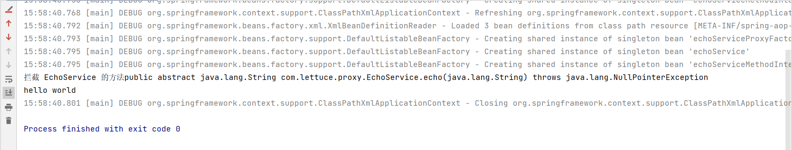
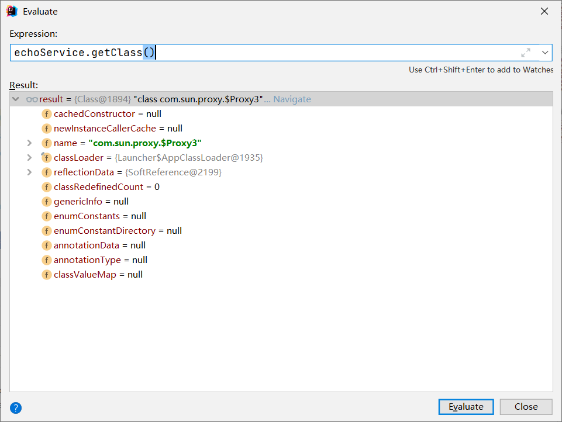
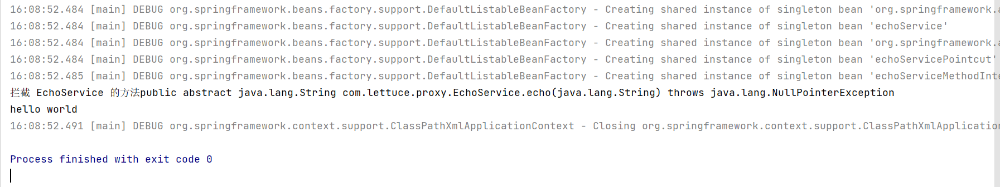

# 自动动态代理

- 代表实现
  - org.springframework.aop.framework.autoproxy.BeanNameAutoProxyCreator
  - org.springframework.aop.framework.autoproxy.DefaultAdvisorAutoProxyCreator
  - org.springframework.aop.aspectj.annotation.AnnotationAwareAspectJAutoProxyCreator

我们来把之前得手动代理的文件进行拷贝一份,先来看BeanNameAutoProxyCreator，通过BeanName来进行自动代理

```xml
  <!-- 要代理的类 -->
    <bean id="echoService" class="com.lettuce.proxy.DefaultEchoService"/>

    <!-- 代理拦截方法 -->
    <bean id="echoServiceMethodInterceptor" class="com.lettuce.interceptor.EchoServiceMethodInterceptor">
    </bean>

    <!-- 代理工厂对象 -->
    <bean id="echoServiceProxyFactoryBean" class="org.springframework.aop.framework.autoproxy.BeanNameAutoProxyCreator">
        <!-- 代理引用 -->
        <property name="beanNames" value="echo*"/>
        <property name="interceptorNames">
            <value>echoServiceMethodInterceptor</value>
        </property>
    </bean>
```

```java
public class AspectJSchemaBasedAutoProxyDemo {
    public static void main(String[] args) {
        ClassPathXmlApplicationContext applicationContext = new ClassPathXmlApplicationContext("classpath:META-INF/spring-aop-auto-proxy-context.xml");

        applicationContext.refresh();
        EchoService echoService = applicationContext.getBean("echoService", EchoService.class);

        System.out.println(echoService.echo("hello world"));

        applicationContext.close();
    }
}
```



拦截到了，然后我们通过Debug来查看是什么的代理



依然是JDK的代理，然后这样的话我们还需要根据名称来进行配置，下来的DefaultAdvisorAutoProxyCreator则是根据对应的Advisor直接进行自动的代理操作。

```xml
    <!-- 要代理的类 -->
    <bean id="echoService" class="com.lettuce.proxy.DefaultEchoService"/>

    <!-- 代理拦截方法 -->
    <bean id="echoServiceMethodInterceptor" class="com.lettuce.interceptor.EchoServiceMethodInterceptor">
    </bean>

    <!-- 代理工厂对象 -->
<!--    <bean id="echoServiceProxyFactoryBean" class="org.springframework.aop.framework.autoproxy.BeanNameAutoProxyCreator">-->
<!--        &lt;!&ndash; 代理引用 &ndash;&gt;-->
<!--        <property name="beanNames" value="echo*"/>-->
<!--        <property name="interceptorNames">-->
<!--            <value>echoServiceMethodInterceptor</value>-->
<!--        </property>-->
<!--    </bean>-->

    <!-- AutoProxy Bean -->
    <bean class="org.springframework.aop.framework.autoproxy.DefaultAdvisorAutoProxyCreator" />

    <!-- Pointcut Bean -->
    <bean id="echoServicePointcut" class="com.lettuce.pointcut.EchoServicePointcut">
        <constructor-arg index="0" value="echo"/>
        <constructor-arg index="1" value="com.lettuce.proxy.EchoService"/>
    </bean>

    <bean class="org.springframework.aop.support.DefaultPointcutAdvisor">
        <constructor-arg index="0" ref="echoServicePointcut"/>
        <constructor-arg index="1" ref="echoServiceMethodInterceptor"/>
    </bean>
```

通过配置对应的执行器，因为DefaultAdvisorAutoProxyCreator也是一个BeanPostProssor，然后呢通过配置DefaultPointcutAdvisor来进行实现代理所有的Advisor。



# 面试

- Spring AOP 支持哪些类型的Advice?
  - Around Advice
  - Before Advice
  - After Advice
    - After
    - AfterReturning
    - AfterThrowing

- Spring AOP 编程模型有哪些，代表组件有哪些？
  - 注解驱动： 解释和整合 AspectJ注解，如@EnableAspectJAutoProxy
  - XML 配置： AOP 与 IOC Schema-Based 相结合
  - API 编程： 如 JoinPoint、Pointcut、Advice和ProxyFactory

- Spring AOP 三种实现方式是如何设计的？