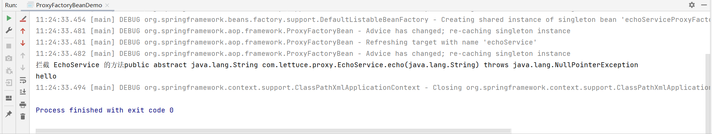

# XML 配置驱动 - 创建AOP代理

- 实现方法
  - 配置 org.springframework.aop.framework
  - Spring Schema-Based 配置
    - \<aop:config>
    - \<aop:aspect-autoproxy/>

SpringAOP代理如何创建？

我们需要先定义对应的xml

```xml
<?xml version="1.0" encoding="UTF-8"?>
<beans xmlns="http://www.springframework.org/schema/beans"
       xmlns:aop="http://www.springframework.org/schema/aop"
       xmlns:context="http://www.springframework.org/schema/context"
       xmlns:xsi="http://www.w3.org/2001/XMLSchema-instance"
       xsi:schemaLocation="http://www.springframework.org/schema/beans
       http://www.springframework.org/schema/beans/spring-beans.xsd
       http://www.springframework.org/schema/aop
       http://www.springframework.org/schema/aop/spring-aop.xsd
       http://www.springframework.org/schema/context
       http://www.springframework.org/schema/aop/spring-context.xsd" >
    <aop:aspectj-autoproxy/>

    <!-- 要代理的类 -->
    <bean id="echoService" class="com.lettuce.proxy.DefaultEchoService"/>

    <!-- 代理拦截方法 -->
    <bean id="echoServiceMethodInterceptor" class="com.lettuce.interceptor.EchoServiceMethodInterceptor">

    </bean>


    <!-- 代理工厂对象 -->
    <bean id="echoServiceProxyFactoryBean" class="org.springframework.aop.framework.ProxyFactoryBean"
          >
        <!-- 代理引用 -->
        <property name="targetName" value="echoService"/>
        <property name="interceptorNames">
            <value>echoServiceMethodInterceptor</value>
        </property>
    </bean>
</beans>
```

1. 首先我们要确定我们要代理的是哪一个类
2. 第二步我们要构建代理的对象，这里面主要有拦截方法，和代理的类
3. 确定拦截方法的具体实现

```java
public class ProxyFactoryBeanDemo {
    public static void main(String[] args) {
        ClassPathXmlApplicationContext applicationContext = new ClassPathXmlApplicationContext("classpath:META-INF/spring-aop-context.xml");
        EchoService echoService = applicationContext.getBean("echoServiceProxyFactoryBean", EchoService.class);
        System.out.println(echoService.echo("hello"));
        applicationContext.close();
    }
}
```

```java
public class EchoServiceMethodInterceptor implements MethodInterceptor {

    @Override
    public Object invoke(MethodInvocation invocation) throws Throwable {
        Method method = invocation.getMethod();
        System.out.println("拦截 EchoService 的方法" + method);
        return invocation.proceed();
    }
}
```



可以看到对应的签名已经打印出来。

