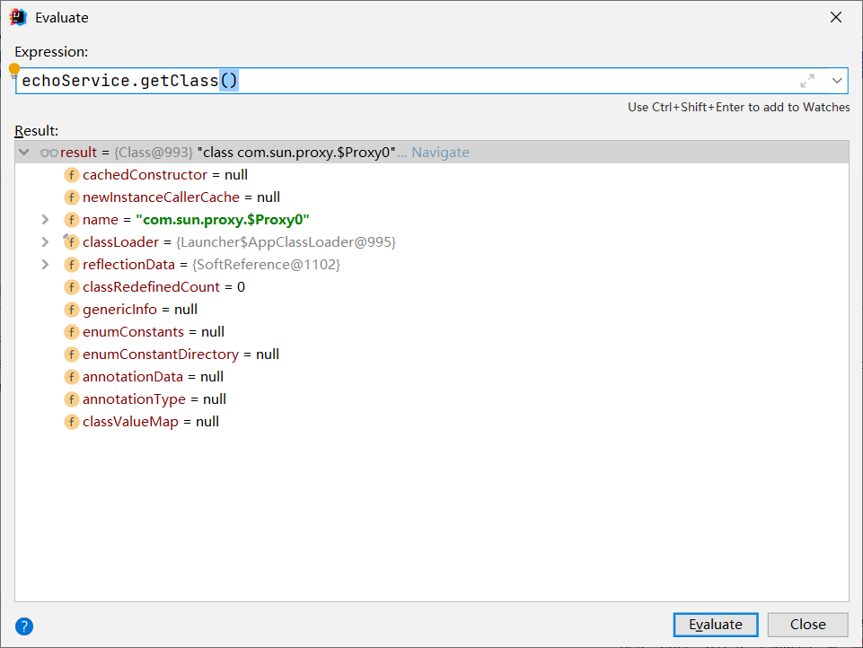
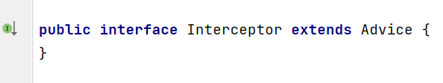

# 标准代理工厂API

- org.springframework.aop.framework.ProxyFactory

```java
public class ProxyFactoryDemo {
    public static void main(String[] args) {
        DefaultEchoService defaultEchoService = new DefaultEchoService();
        // 注入目标对象
        ProxyFactory proxyFactory = new ProxyFactory(defaultEchoService);
        // 添加 Advice
        proxyFactory.addAdvice(new EchoServiceMethodInterceptor());
        // 获取代理对象
        EchoService echoService = (EchoService) proxyFactory.getProxy();
        System.out.println(echoService.echo("hello, world"));
    }
}
```

在这里首先注入了目标对象，并添加了Advice，问题来了这里生成的代理类是什么代理的？

我们来进行Debug尝试



可以看到这里仍然是采用JDK动态代理实现，并且是生成的第一个代理类。

第二个问题：为什么Inteceptor可以被设置为Advice，这里就需要去查看下Advice的类图



