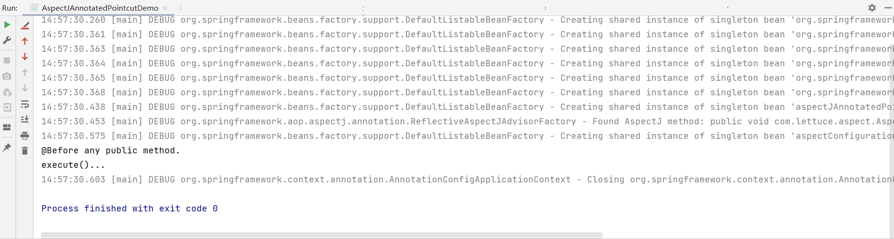

# @AspectJ Pointcut 指令与表达式

- 支持的指令
  - execution: For matching method execution join points.This is the primary pointcutdesignator to use when working with Spring AOP.
  - within: Limits matching to join points within certain types (the execution of a methoddeclared within a matching type when using Spring AOP).
  - this: Limits matching to join points (the execution of methods when using Spring AOP)where the bean reference (Spring AOP proxy) is an instance of the given type.
  - target: Limits matching to join points (the execution of methods when using Spring AOP) where the target object (application object being proxied) is an instance of the given type.
  - args: Limits matching to join points (the execution of methods when using Spring AOP)where the arguments are instances of the given types.

我们来进行注解方式的来运用Pointcut

首先便是配置类

```java
@Aspect
public class AspectConfiguration {

    /**
     * 任意方法拦截
     */
    @Pointcut("execution(public * *(..))") // 只进行判断不进行执行
    private void anyPublicMethod() { // 方法名
        System.out.println("@Pointcut at any public method.");
    }

    @Before("anyPublicMethod()") // 动作
    public void beforeanyPublicMethod() {
        System.out.println("@Before any public method.");
    }
}
```

然后便是我们的测试类

```java
@Configuration
@EnableAspectJAutoProxy
public class AspectJAnnotatedPointcutDemo {
    public static void main(String[] args) {
        AnnotationConfigApplicationContext applicationContext = new AnnotationConfigApplicationContext();
        applicationContext.register(AspectJAnnotatedPointcutDemo.class, AspectConfiguration.class);

        applicationContext.refresh();
        AspectJAnnotatedPointcutDemo bean = applicationContext.getBean(AspectJAnnotatedPointcutDemo.class);
        bean.execute();
        applicationContext.close();
    }

    public void execute() {
        System.out.println("execute()...");
    }
}
```



可以看到Pointcut中的代码没有执行，由此可以判断，切入点仅仅是一个点并不涉及到方法的执行。