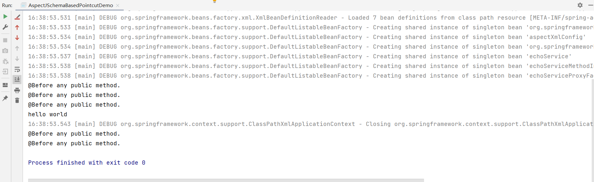

# XML配置Pointcut

- XML配置
  - \<aop:pointcut/>

首先是建立切入点的代码

```java
public class AspectXmlConfig {

    public void beforeAnyPublicMethod() {
        System.out.println("@Before any public method.");
    }
}
```

然后是我们的测试类

```java
@Configuration
public class AspectJSchemaBasedPointcutDemo {
    public static void main(String[] args) {
        ClassPathXmlApplicationContext applicationContext = new ClassPathXmlApplicationContext("classpath:META-INF/spring-aop-context.xml");

        applicationContext.refresh();
        EchoService echoService = applicationContext.getBean("echoService", EchoService.class);

        System.out.println(echoService.echo("hello world"));

        applicationContext.close();
    }
}
```

配置我们的xml文件

```xml
<?xml version="1.0" encoding="UTF-8"?>
<beans xmlns="http://www.springframework.org/schema/beans"
       xmlns:aop="http://www.springframework.org/schema/aop"
       xmlns:context="http://www.springframework.org/schema/context"
       xmlns:xsi="http://www.w3.org/2001/XMLSchema-instance"
       xsi:schemaLocation="http://www.springframework.org/schema/beans
       http://www.springframework.org/schema/beans/spring-beans.xsd
       http://www.springframework.org/schema/aop
       http://www.springframework.org/schema/aop/spring-aop.xsd
       http://www.springframework.org/schema/context
       http://www.springframework.org/schema/aop/spring-context.xsd" >
    <aop:aspectj-autoproxy/>

    <bean id="aspectXmlConfig" class="com.lettuce.aspect.AspectXmlConfig"/>

    <aop:config>
        <aop:aspect id="AspectXmlConfig" ref="aspectXmlConfig">
            <aop:pointcut id="anyPublicMethod" expression="execution(public * *(..))"/>
            <aop:before method="beforeAnyPublicMethod" pointcut-ref="anyPublicMethod"/>
        </aop:aspect>
    </aop:config>

    <!-- 要代理的类 -->
    <bean id="echoService" class="com.lettuce.proxy.DefaultEchoService"/>

    <!-- 代理拦截方法 -->
    <bean id="echoServiceMethodInterceptor" class="com.lettuce.interceptor.EchoServiceMethodInterceptor">

    </bean>


    <!-- 代理工厂对象 -->
    <bean id="echoServiceProxyFactoryBean" class="org.springframework.aop.framework.ProxyFactoryBean"
          >
        <!-- 代理引用 -->
        <property name="targetName" value="echoService"/>
        <property name="interceptorNames">
            <value>echoServiceMethodInterceptor</value>
        </property>
    </bean>
</beans>
```

最后我们执行



这里执行了很多次，那是因为拦截了所有的public方法，如果我们想要拦截指定的，那么我们还需要关注一下表达式。