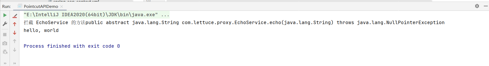
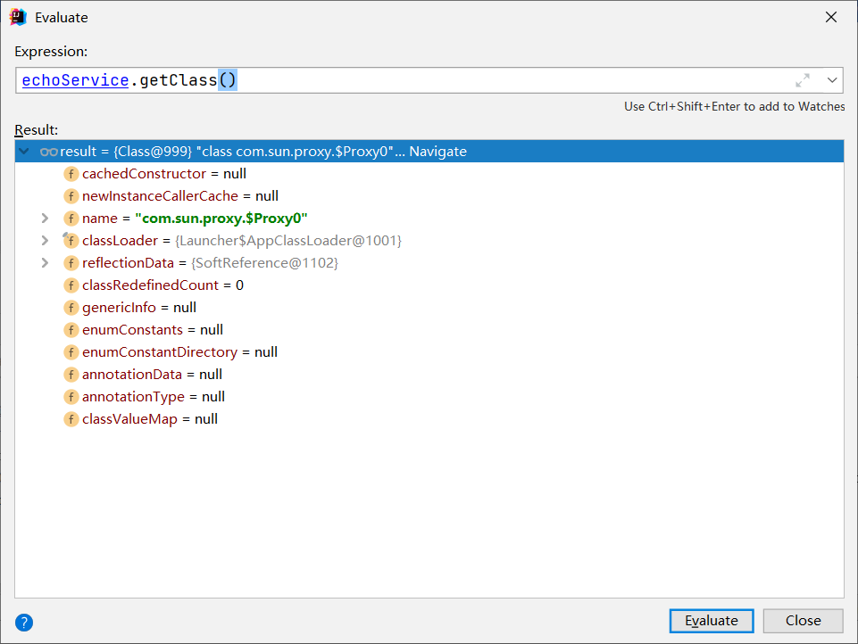

# API实现Pointcut

- 核心API -org.springframework.aop.Pointcut
  - org.springframework.aop.ClassFilter
  - org.springframework.aop.MethodMacher

- 适配实现 -DefaultPointcutAdvisor

我们先来看一下Pointcut这个接口

```java
public interface Pointcut {
    Pointcut TRUE = TruePointcut.INSTANCE;
		
    ClassFilter getClassFilter();

    MethodMatcher getMethodMatcher();
}
```

它下面有对应的实现类

```java
public abstract class StaticMethodMatcherPointcut extends StaticMethodMatcher implements Pointcut {
    private ClassFilter classFilter;

    public StaticMethodMatcherPointcut() {
        this.classFilter = ClassFilter.TRUE;
    }

    public void setClassFilter(ClassFilter classFilter) {
        this.classFilter = classFilter;
    }

    public ClassFilter getClassFilter() {
        return this.classFilter;
    }

    public final MethodMatcher getMethodMatcher() {
        return this;
    }
}
```

我们通过这个类来进行方法的匹配

```java
public class EchoServicePointcut extends StaticMethodMatcherPointcut {

    private String methodName;

    private Class targetClass;

    public EchoServicePointcut(String methodName, Class targetClass) {
        this.methodName = methodName;
        this.targetClass = targetClass;
    }

    @Override
    public boolean matches(Method method, Class<?> targetClass) {
        return Objects.equals(methodName, method.getName())
                && this.targetClass.isAssignableFrom(targetClass);
    }

    public String getMethodName() {
        return methodName;
    }

    public void setMethodName(String methodName) {
        this.methodName = methodName;
    }

    public Class getTargetClass() {
        return targetClass;
    }

    public void setTargetClass(Class targetClass) {
        this.targetClass = targetClass;
    }
}
```

```java
public class PointcutAPIDemo {
    public static void main(String[] args) {
        EchoServicePointcut pointcut = new EchoServicePointcut("echo", EchoService.class);
        // 将 Pointcut 适配成 Advisor
        DefaultPointcutAdvisor advisor = new DefaultPointcutAdvisor(pointcut, new EchoServiceMethodInterceptor());

        DefaultEchoService defaultEchoService = new DefaultEchoService();
        ProxyFactory proxyFactory = new ProxyFactory(defaultEchoService);
        // 添加Advisor
        proxyFactory.addAdvisor(advisor);
        // 获取代理对象
        EchoService echoService = (EchoService) proxyFactory.getProxy();
        System.out.println(echoService.echo("hello, world"));
     }
}
```



那么这个时候我们就要像上述代码的作用了。 首先便是pointcut的作用，pointcut只起到过滤和拦截的作用，然后具体的增强是在拦截的方法中，因为是Spring做的适配，所以要转化为Advisor才能进行使用，然后到了下一步真正执行的是代理的对象，至此所有的流程结束。



可以看到代理还是JDK的代理。