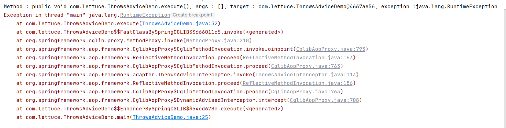

# Joinpoint After Advice标准实现

- 接口

  - org.springframework.aop.AfterAdvice

  - org.springframework.aop.AfterReturningAdyice. 

  - org.springframework.aop.ThrowsAdvice

- 实现
  - org.springframework.aop.framework.adapter.ThrowsAdviceInterceptor
  -  org.springframework.aop.framework.adapter.AfterReturningAdviceInterceptor

```java
public interface AfterAdvice extends Advice {

}
```

```java
public interface AfterReturningAdvice extends AfterAdvice {

	void afterReturning(@Nullable Object returnValue, Method method, Object[] args, @Nullable Object target) throws Throwable;

}
```

```java
public interface ThrowsAdvice extends AfterAdvice {

}
```

和之前的相同，转化为Inteceptor实现，会进行包装。

```java
public class ThrowsAdviceDemo {
    public static void main(String[] args) {
        ThrowsAdviceDemo instance = new ThrowsAdviceDemo();

        ProxyFactory proxyFactory = new ProxyFactory(instance);

        proxyFactory.addAdvice(new MyThrowsAdvice());

        ThrowsAdviceDemo proxy = (ThrowsAdviceDemo) proxyFactory.getProxy();
        proxy.execute();
    }

    public void execute() {
        Random random = new Random();

        if (random.nextBoolean()) {
            throw new RuntimeException();
        }
        System.out.println("Executing...");
    }
}
```

```java
public class MyThrowsAdvice implements ThrowsAdvice {

    public void afterThrowing(Exception e) {
        System.out.printf("Exception: %s\n", e);
    }

    public void afterThrowing(Method method, Object[] args, Object target, Exception e) {
        System.out.printf("Method : %s, args : %s, target : %s, exception :%s\n",
                method,
                Arrays.asList(args),
                target,
                e);
    }
}
```



实现不同的重载时需要实现不同的Exception。