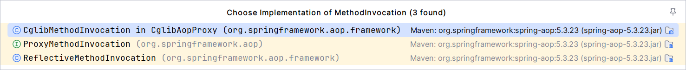

## 接入点接口-Joinpoint

- lnterceptor 执行上下文- lnvocation

  - 方法拦截器执行上下文-Methodlnvocation

  - ~~构造器拦截器执行上下文-Constructorlnvocation~~

- MethodInvocation 实现
  - 基于反射- ReflectiveMethodInvocation
  - 基于CGLIB - CglibMethodInvocation

```java
/**
连接点
*/
public interface Joinpoint {
	// 因为SpringAOP仅支持方法的级别的拦截，这里是指调用方法
	@Nullable
	Object proceed() throws Throwable;
	
    // 所持有的代理对象
	@Nullable
	Object getThis();
	// 静态部分是安装拦截器链的可访问的对象等
	@Nonnull
	AccessibleObject getStaticPart();

}
```

```java
/**
对于调用来说的话，一般只有方法和构造器可以 被调用，但是Spring只支持方法级别的调用，所以这里Spring只对方法进行了实现
*/
public interface Invocation extends Joinpoint {
	
    // 调用时上下文传递的参数
	@Nonnull
	Object[] getArguments();

}
```

```java
// 具体的实现有两种，一种是CGLib 一种是基于JAVA反射实现
public interface MethodInvocation extends Invocation {

	/**
	 * Get the method being called.
	 * <p>This method is a friendly implementation of the
	 * {@link Joinpoint#getStaticPart()} method (same result).
	 * @return the method being called
	 */
    // 返回对应的方法
	@Nonnull
	Method getMethod();

}
```

这里有一个接口也就是ProxyMethodInvocation 这里主要是通过名称来进行规范下面的具体行为（代理方法），一种是基于Cglib,一种是基于JAVA的反射来进行实现。



